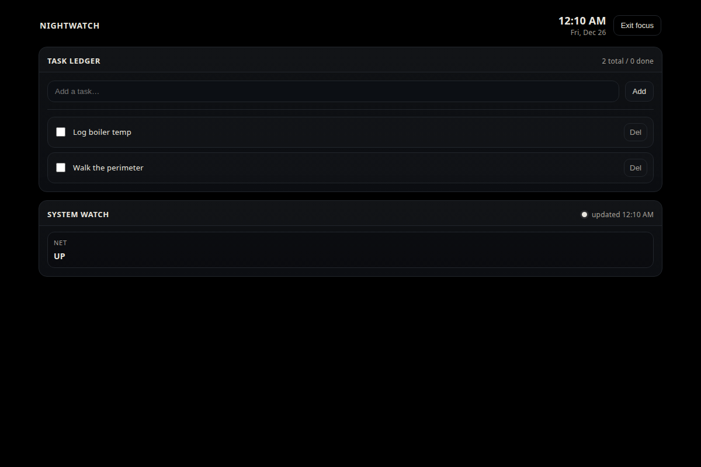

## What It Is

Nightwatch OS Dashboard is a local-first desktop dashboard for Linux that provides shift logging, a task ledger, and basic system status in a restrained UI.

## Why It Exists

Overnight operators need a calm, reliable control panel that favors clear state over decoration, and keeps data local with minimal moving parts.

## Requirements

- **Python**: 3.10+
- **OS**: Linux-first (desktop + Raspberry Pi). Others untested.
- **Debian/Ubuntu**: `python3-venv` (required for `python3 -m venv`)

## How to Run

Debian/Ubuntu (once):

```bash
sudo apt install -y python3-venv
```

```bash
cd /path/to/repo
python3 -m venv .venv
. .venv/bin/activate
python -m pip install -U pip
python -m pip install -e .
python -m nightwatch
```

Open `http://127.0.0.1:8037/`.

If you can’t (or won’t) use a venv:

```bash
python3 -m pip install -U --user pip
python3 -m pip install -e . --user
python3 -m nightwatch
```

CLI (headless):

```bash
python3 -m nightwatch status
python3 -m nightwatch start-shift
python3 -m nightwatch end-shift
python3 -m nightwatch tasks
```

Config:

- **`nightwatch.toml`** is read from the current working directory (or `~/.config/nightwatch/nightwatch.toml`).
- Env vars override config (`NIGHTWATCH_DATA_DIR`, `NIGHTWATCH_DB_PATH`, `NIGHTWATCH_BACKUPS_DIR`, `NIGHTWATCH_HOST`, `NIGHTWATCH_PORT`).

## API Surface (MVP)

All responses are JSON unless noted.

- **GET `/api/health`**: health probe.
  - **200**: `{ "ok": true }`

- **GET `/api/system`**: system snapshot (CPU/RAM/disk/temp/network).
  - **200**:
    - `{ "at": "<iso>", "cpu_percent": <float>, "ram_percent": <float>, "ram_used_mb": <int>, "ram_total_mb": <int>, "disk_percent": <float>, "disk_used_gb": <float>, "disk_total_gb": <float>, "temp_c": <float|null>, "network_up": <bool> }`

- **GET `/api/shift/current`**: current active shift (or none).
  - **200**: `null` or `{ "id": <int>, "started_at": "<iso>", "ended_at": null, "notes": "<string>" }`

- **POST `/api/shift/start`**: start a shift; carries unfinished tasks forward.
  - **200**:
    - `{ "shift": { "id": <int>, "started_at": "<iso>", "ended_at": null, "notes": "<string>" }, "carried_task_count": <int>, "already_active": <bool> }`

- **POST `/api/shift/end`**: end the active shift.
  - **200**: `{ "id": <int>, "started_at": "<iso>", "ended_at": "<iso>", "notes": "<string>" }`
  - **409**: `{ "detail": "No active shift." }`

- **PUT `/api/shift/{shift_id}/notes`**: replace notes for a shift.
  - **body**: `{ "notes": "<string>" }`
  - **200**: `{ "id": <int>, "started_at": "<iso>", "ended_at": "<iso|null>", "notes": "<string>" }`
  - **404**: `{ "detail": "Shift not found." }`

- **GET `/api/tasks/current`**: tasks for the active shift.
  - **200**: `[ { "id": <int>, "title": "<string>", "created_at": "<iso>", "completed_at": "<iso|null>", "shift_id": <int|null> }, ... ]`

- **POST `/api/tasks`**: create a task (assigned to active shift if present).
  - **body**: `{ "title": "<string>" }`
  - **200**: `{ "id": <int>, "title": "<string>", "created_at": "<iso>", "completed_at": null, "shift_id": <int|null> }`

- **POST `/api/tasks/{task_id}/complete`**: mark task complete.
  - **200**: `{ "id": <int>, "title": "<string>", "created_at": "<iso>", "completed_at": "<iso>", "shift_id": <int|null> }`
  - **404**: `{ "detail": "Task not found." }`

- **POST `/api/tasks/{task_id}/reopen`**: mark task incomplete.
  - **200**: `{ "id": <int>, "title": "<string>", "created_at": "<iso>", "completed_at": null, "shift_id": <int|null> }`
  - **404**: `{ "detail": "Task not found." }`

- **DELETE `/api/tasks/{task_id}`**: delete task.
  - **200**: `{ "ok": true }`
  - **404**: `{ "detail": "Task not found." }`

## MVP Features

- Start/end shift with automatic timestamps
- Notes per shift (plain text / markdown)
- Task ledger with complete/reopen/delete
- Carry unfinished tasks to the next shift on shift start
- System watch: CPU, RAM, disk, temperature (when available), network up/down
- Focus Mode (blackout UI; clock + tasks + heartbeat)
- SQLite migrations (versioned SQL)
- Daily SQLite backup (prefers `/backups/`, falls back to `data_dir/backups`)
- CLI companion (`nightwatch status/start-shift/end-shift/tasks`)

## Non-Goals

- Cloud sync, accounts, or multi-user permissions
- Alerting/notification systems
- Cross-platform support guarantees (Linux-first; others untested)
- Encrypted notes (not in MVP)

## Screenshot


