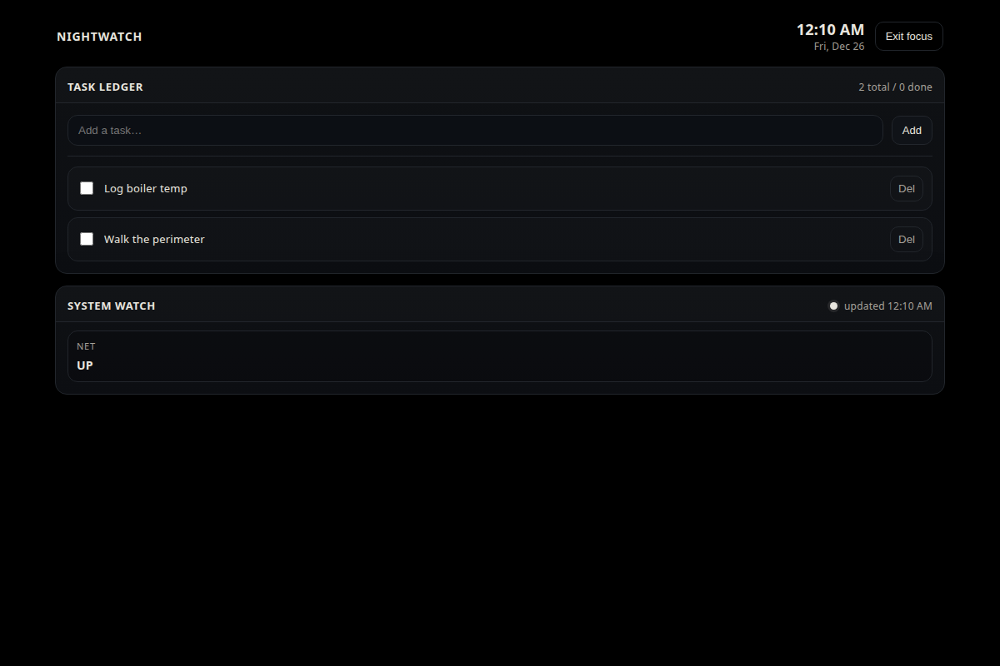

# Night-watch-OS

Night-watch-OS is a local-first Linux dashboard for overnight operators, combining shift logging, task tracking, and basic system visibility in a restrained interface.

## What It Is

This project is a Python application with two operator surfaces:

- a local web dashboard served with FastAPI
- a lightweight CLI for headless use

It stores data locally, tracks active shifts, records task flow, captures notes, and exposes a small JSON API for the dashboard.

## Why It Exists

Night-watch-OS exists because overnight work benefits from calm tooling that shows the current state clearly, keeps data local, and avoids unnecessary complexity.

## Problem It Solves

Operators often end up juggling notes, task lists, and system checks across multiple tools. Night-watch-OS brings those basics into one local control surface with minimal moving parts.

## Features

- start and end shifts with automatic timestamps
- carry unfinished tasks into the next shift
- track open and completed tasks
- store notes for each shift
- read basic system health such as CPU, RAM, disk, temperature, and network status
- provide a focus-mode style operator dashboard
- persist data in SQLite with migrations and daily backups
- expose a small CLI for status and shift actions

## Tech Stack

- Python 3.10+
- FastAPI
- Uvicorn
- SQLAlchemy
- Pydantic
- SQLite
- psutil
- static HTML, CSS, and JavaScript

## Quick Start

Debian or Ubuntu users may need:

```bash
sudo apt install -y python3-venv
```

Recommended local setup:

```bash
cd /path/to/Night-watch-OS
python3 -m venv .venv
. .venv/bin/activate
python -m pip install -U pip
python -m pip install -e .
python -m nightwatch
```

Open `http://127.0.0.1:8037/`.

If you prefer not to use a virtual environment:

```bash
python3 -m pip install -U --user pip
python3 -m pip install -e . --user
python3 -m nightwatch
```

Configuration is read from `nightwatch.toml` in the current working directory or `~/.config/nightwatch/nightwatch.toml`. Environment variables can override data and server settings.

## CLI / API Usage

CLI:

- `python3 -m nightwatch status`
- `python3 -m nightwatch start-shift`
- `python3 -m nightwatch end-shift`
- `python3 -m nightwatch tasks`
- `python3 -m nightwatch serve --host 127.0.0.1 --port 8037`

Key API routes:

- `GET /api/health`
- `GET /api/system`
- `GET /api/shift/current`
- `POST /api/shift/start`
- `POST /api/shift/end`
- `PUT /api/shift/{shift_id}/notes`
- `GET /api/tasks/current`
- `POST /api/tasks`
- `POST /api/tasks/{task_id}/complete`
- `POST /api/tasks/{task_id}/reopen`
- `DELETE /api/tasks/{task_id}`

## Screenshots



## Status

Current status: MVP complete and core stable.

Implemented now:

- local dashboard server
- shift lifecycle and task ledger
- system snapshot endpoint
- SQLite persistence and migrations
- backup loop
- CLI companion commands

Current boundaries:

- Linux-first target
- no cloud sync
- no multi-user permissions
- no notification or alerting layer

## Roadmap

- add more tests around services and API behavior
- improve operator reporting and handoff visibility
- expand documentation for deployment on Raspberry Pi and Linux hosts
- refine the UI without widening scope beyond local operations

## Portfolio Note

Night-watch-OS shows a practical Blackfong direction: local-first tooling for operators, not a generic dashboard demo. It demonstrates restrained product thinking across backend, frontend, CLI, persistence, and daily-use workflow design.
